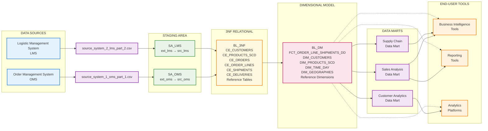

# Complete DWH for Supply Chain with Idempotent Loading &amp; SCD Type 2 Handling 

Data warehouse implementation following Kimball dimensional modeling methodology. 
The system processes 1M+ supply chain records from Order Management (OMS) 
and Logistics Management (LMS) systems, delivering comprehensive analytics from order placement to final delivery.

---
>[BL_3NF_design.mmd](DWH_design%2FBL_3NF_design.mmd) | [BL_DM_design.mmd](DWH_design%2FBL_DM_design.mmd) | [Data_Flow_diagram.mmd](DWH_design%2FData_Flow_diagram.mmd) | [Load_Logic_diagram.mmd](DWH_design%2FLoad_Logic_diagram.mmd) | [Supply_Chain_DWH_documentation.pdf](DWH_design%2FSupply_Chain_DWH_documentation.pdf)
---

## Load flow

## 🏗️ Architecture Strengths

### 1. Methodological Excellence
- **Kimball 4-Step Process**: Proper business process selection, grain definition, dimension identification, and fact design
- **Grain Definition**: "One row per order line item per shipment" - perfectly balances analytical flexibility with performance
- **SCD Implementation**: Strategic mix of Type 0, 1, and 2 slowly changing dimensions based on business requirements

### 2. Data Modeling Excellence
- **3NF Foundation**: Proper normalization eliminates redundancy while maintaining referential integrity
- **Star Schema Design**: Clean dimensional model with 12 dimensions and 1 central fact table
- **Hybrid Keys**: Smart use of surrogate keys with business key constraints for performance and traceability

### 3. Advanced Technical Features
- **Partitioning Strategy**: Monthly range partitioning with 3-month rolling windows for optimal performance
- **Audit Framework**: Comprehensive technical attributes (TA_INSERT_DT, TA_UPDATE_DT, source triplets)
- **Data Quality**: Built-in validation, missing dimension detection, and comprehensive logging

---

## 📊 Business Value Delivered

### Core KPIs Supported
- **Order Fulfillment**: Perfect order rate, fill rate analysis, cycle time tracking
- **Financial Performance**: Revenue, margin analysis, landed cost calculations  
- **Logistics Excellence**: On-time delivery, carrier performance, shipping cost optimization
- **Operational Efficiency**: Processing times, backorder management, warehouse performance

---

## 💡  Design Decisions

### 1. Dataset Division Strategy
Brilliantly split the original dataset into realistic OMS/LMS systems:
- **OMS**: Financial and customer focus (60% of data)
- **LMS**: Operational and logistics focus (40% of data)
- **Integration**: Natural OrderID = ShipmentID linkage

### 2. Calculated Metrics Framework
- **Runtime Calculations**: Total landed cost, net profit, profit margins
- **Business Logic**: Fill rates, on-time delivery flags, allocated shipping costs
- **Flexibility**: Metrics calculated at query time for maximum analytical flexibility

### 3. Geographic & Product Hierarchies
- **4-Level Geography**: Region → Country → State → City → Geography
- **4-Level Product**: Department → Category → Brand → Product
- **Territory Management**: Sales rep to geography mapping

---

## 🔧 Technical Implementation

### Data Pipeline Sophistication
- **12-Stage ETL Process**: From extraction through final fact loading
- **Dual Staging**: External (ext_) and source (src_) staging for data quality
- **SCD Processing**: Automated Type 2 handling for product historical tracking
- **Incremental Loading**: Delta detection with partition-aware processing

### Performance Optimization
- **36 Monthly Partitions**: 2023-2025 coverage with rolling window management
- **Query Performance**: 0ms response time for partition-aware queries
- **Scalable Architecture**: Supports 500K+ records with room for growth
- **Complete cursor FOR loop implementation** with proper error handling

### Logging & Orchestration Framework
- **Complete procedure execution logging** with lock management and error handling
- **Master Orchestration procedure** for coordinated ETL execution
- **Role-Based Security**: `dwh_cleansing_role` → `dwh_cleansing_user` with proper permissions

---

---

## 🚀 Deployment Readiness

### Production Ready Features
- Comprehensive data model with business validation
- Robust ETL pipeline with error handling
- Performance optimized with partitioning
- Full documentation and data lineage

---

